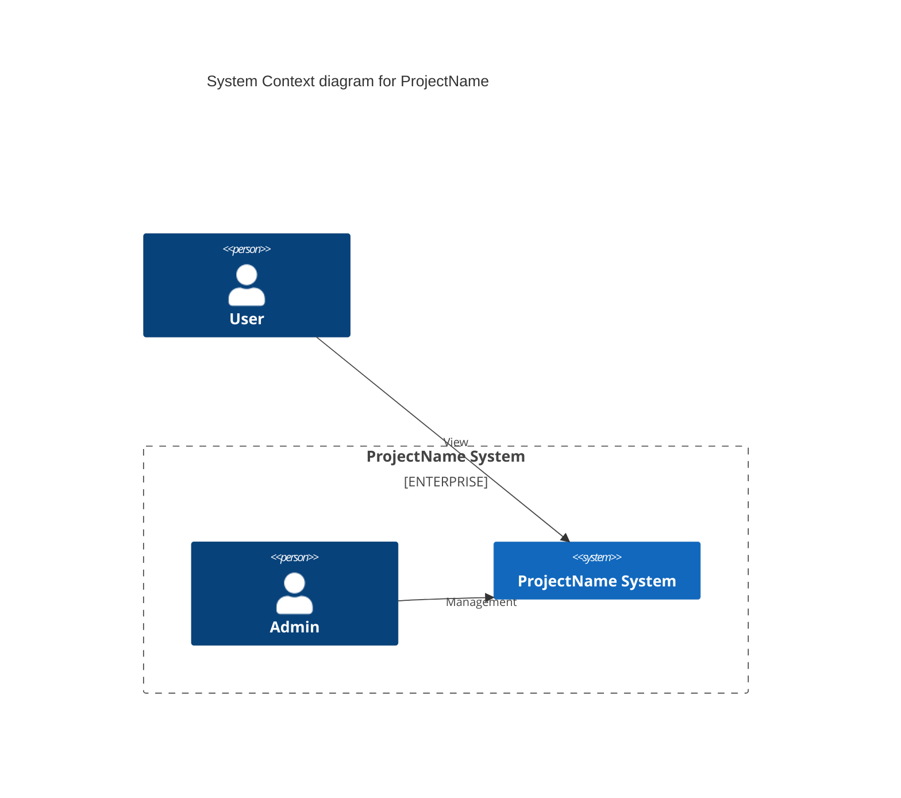
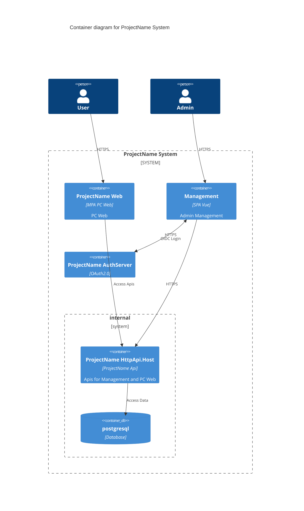

# vz project template.

This is a typescript+vue3+vite project template for abp (as backend).

## Usage

```bash
git clone https://github.com/personball/vz-vue.git
dotnet tool install vz-generator -g
vz rn vz-vue -r ProjectName=Demo -o ./demo/
```

## Project Setup

```bash
yarn
npx simple-git-hooks  # setup git hooks
npm run dev           # develop 
npm run build:prod    # build production
```

### Custom theme

See `src/styles/element/index.scss`.

## Features

- [x] [vue3.0](https://cn.vuejs.org)
- [x] [vite](https://cn.vitejs.dev)
- [x] [pinia](https://pinia.web3doc.top)
- [x] [vue-router](https://router.vuejs.org/) + [file-based router: unplugin-vue-router](https://github.com/posva/unplugin-vue-router)
- [x] [@vueuse/core](https://vueuse.org)
- [x] [vitest](https://cn.vitest.dev) + [vue/test-utils](https://test-utils.vuejs.org)
- [x] [vue-i18n@9](https://vue-i18n.intlify.dev)
- [x] [axios](https://axios-http.com)
- [x] auto import api: [unplugin-auto-import](https://github.com/unplugin/unplugin-auto-import)
- [x] auto import components: [unplugin-vue-components](https://github.com/unplugin/unplugin-vue-components)
- [x] [vite-plugin-vue-layouts](https://github.com/JohnCampionJr/vite-plugin-vue-layouts) with [routes fix](https://github.com/posva/unplugin-vue-router/issues/121)
- [x] auto register modules: https://github.com/antfu/vitesse/tree/main/src/modules
- [x] auto register directives
- [x] [element-plus](https://github.com/element-plus)
- [x] integrate [abp](https://abp.io);
  - [x] [vue3-oidc](https://github.com/zhazhazhu/vue3-oidc) with abp AuthServer
  - [x] currentUser & currentTenant
  - [x] acl permissions:
    - directive `v-acl="'p1'"`
    - directive `v-acl="['p1','p2']"`
    - directive `v-acl.any="['p1','p2']"`
    - composable `isGranted(...policies: string[])`
    - composable `isGrantedAnyOf(...policies: string[])`
  - [x] features `useFeatureStore()`:
  - [x] abp localization (with key format as `Resource::Key`) integrate into vue-i18n-next(vue-i18n@9);
  - [x] settings `useSettingStore()`;
- [x] nswag auto generate api proxies;
- [x] [mitt](https://github.com/developit/mitt);
- [x] [formily](https://formilyjs.org), add [formilyjs/element-plus](https://github.com/formilyjs/element-plus)
- [x] [unplugin-icons](https://github.com/unplugin/unplugin-icons)
- [x] jsx/tsx use [vuejs/babel-plugin-jsx](https://github.com/vuejs/babel-plugin-jsx) through [vitejs/plugin-vue-jsx](https://github.com/vitejs/vite-plugin-vue/tree/main/packages/plugin-vue-jsx)

**注意**  
受限于 `@formily/element-plus@1.1.0` 依赖于 `element-plus@^2.4.0`, 不要升级后者。

## Folder Structure

```bash
src/
├── api/        # nswag 生成 api 代理到该目录
├── components/ # 全局组件（自动注册）
├── composables/ # 自定义组合函数：基于 vue3.0 带状态的可复用逻辑封装
├── directives/ # 自定义指令（自动注册）
├── layouts/    # 布局组件，详见 vite-plugin-vue-layouts
├── locales/    # 本项目静态的多语言文件
├── modules/    # 加载插件或各种应用级别初始化逻辑 (会由 main.ts 自动加载, 为 main.ts 瘦身)
├── routes/     # 业务逻辑主要放这 (基于文件系统的路由，详见: unplugin-vue-router)
├── stores/     # pinia stores
├── styles/
├── App.vue
├── main.ts
└── oidc.ts     # vue3-oidc 初始化, 由 main.ts 加载

```

In English:

```bash
src/
├── api/        # nswag generate target
├── components/ # global components (will auto import)
├── composables/ # functions
├── directives/ # custom directives (will auto register)
├── layouts/    # see vite-plugin-vue-layouts
├── locales/    # static languages file
├── modules/    # load plugins or do some app init logic (will auto load in main.ts)
├── routes/     # your business place (file-based router: unplugin-vue-router)
├── stores/     # pinia stores
├── styles/
├── App.vue
├── main.ts
└── oidc.ts     # vue3-oidc init, load by main.ts

```

## Remark

Base on [element-plus-vite-starter](https://github.com/element-plus/element-plus-vite-starter)

alternative ui:

- [ ] [antdv](https://antdv.com)，[antdv-pro](https://docs.antdv-pro.com)
- [ ] [naiveui](https://www.naiveui.com/)

alternative form fw:

TODO:

- [ ] [表单设计器](https://formilyjs.org/zh-CN/guide/form-builder)
- [ ] 分离前后端代码库，保留 element-plus，单独拎一个前端项目切换到 antdv
- [ ] 尝试 formily/form-builder (这是个 react 项目)
- [ ] 为 formily 适配 naiveui, formily/naiveui ?

keep eye on [shoelace](https://shoelace.style)

## ProjectName





